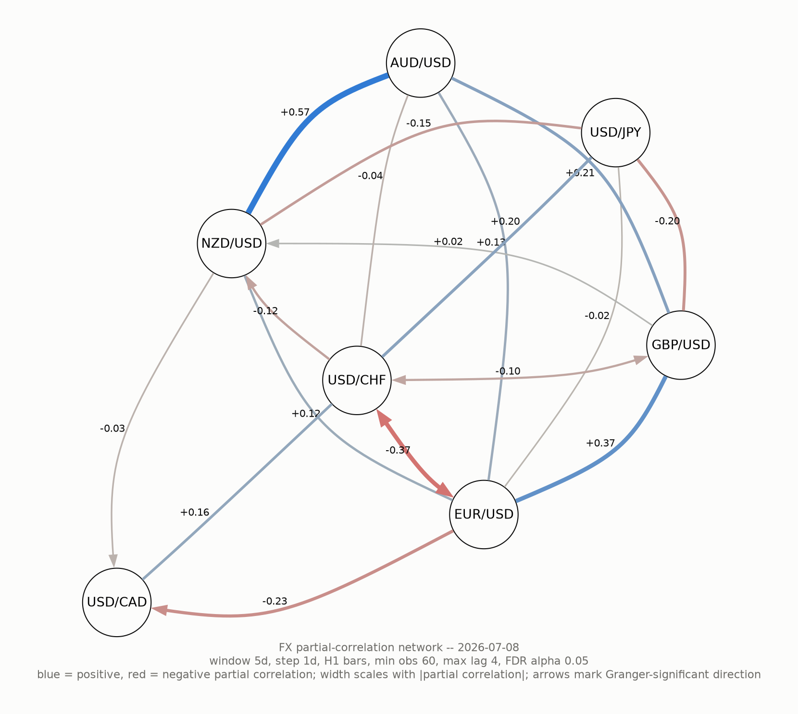

# fx-pcn

A time-varying partial-correlation network, with Granger-causal edge
direction, over the 7 major FX pairs (`EUR/USD`, `GBP/USD`, `USD/JPY`,
`USD/CHF`, `USD/CAD`, `AUD/USD`, `NZD/USD`).

For each day, the pipeline looks back over a trailing window of hourly bars and
asks two questions of every pair of currencies: *are these two conditionally
dependent right now, net of everyone else's influence?* and, if so, *which one
is leading the other?* The result is a graph — nodes are the 7 pairs, edges are
the relationships that window supports — and because it's refit on every date
in the series, that graph can be watched evolving over time.

## Installation

Requires Python >= 3.11.

```bash
pip install .
# or, for development (adds pytest, ruff, mypy):
pip install -e ".[dev]"
```

This installs the `fx-pcn` command (a console-script entry point) along with the
`fx_pcn` package. The project is a standard PEP 517/518 package (`hatchling`
backend) — nothing about it is specific to any particular installer.

> This repo's own `.venv` happens to be managed with [`uv`](https://docs.astral.sh/uv/)
> (`uv sync --extra dev`) rather than raw `pip`, but that's a local-development
> choice, not a requirement — plain `pip install` works from a clean checkout.

`render-graph` (below) additionally needs a system install of
[Graphviz](https://graphviz.org/) with the neato-family layout plugin available
— e.g. on Debian/Ubuntu, `apt install graphviz libgvplugin-neato-layout8`.
Check with `dot -v 2>&1 | grep layout`; it should list `circo`/`neato`/`fdp`,
not just `dot`.

## Configuration

The pipeline reads FX bar data from InfluxDB, but doesn't populate it —
that's the job of a separate repo,
[`ETL-forex-time-series-data`](https://github.com/badass-data-science/ETL-forex-time-series-data),
which pulls raw FX bars and writes them into InfluxDB in the wide,
forward-filled form `fx_pcn.influx_client`/`data.py` expect. Run that
pipeline (or otherwise populate a compatible InfluxDB bucket) before running
`fx-pcn` against real data.

These environment variables must already be set in the shell you run
`fx-pcn` from — there is no `.env` file:

```
INFLUXDB_URL
INFLUXDB_TOKEN
INFLUXDB_ORG
INFLUXDB_BUCKET
```

e.g.:

```bash
export INFLUXDB_URL=https://...
export INFLUXDB_TOKEN=...
export INFLUXDB_ORG=...
export INFLUXDB_BUCKET=...
```

No credentials are needed just to run the test suite (`pytest`) — it exercises
the statistics on synthetic data and never touches InfluxDB.

## Running it

Everything goes through the `fx-pcn` command (or `python -m fx_pcn.cli`):

```bash
# Build the edge table (full history since 2015)
fx-pcn run-pipeline --output output/edges.parquet

# Quick smoke test against the last 30 days only
fx-pcn run-pipeline --output output/edges.parquet --days 30

# Later on: pull in whatever's new since the last run, without refitting history
fx-pcn run-pipeline --output output/edges.parquet --append

# Render the most recent date's graph as a PNG
fx-pcn render-graph --input output/edges.parquet --output output/graph.png
```

`run-pipeline` options (all optional except `--output`):

| Flag | Default | Meaning |
|---|---|---|
| `--output` | *(required)* | Parquet path to write the edge table to |
| `--days` | full history since 2015 | Only pull the last N days |
| `--window-days` | 5 | Trailing window size, in days |
| `--step-days` | 1 | Days between successive windows |
| `--min-observations` | 60 | Minimum complete-case bars required per window, else it's skipped |
| `--max-lag` | 4 | Max lag tested for Granger causality |
| `--fdr-alpha` | 0.05 | Benjamini-Hochberg FDR threshold for direction significance |
| `--granularity` | H1 | Bar granularity to fetch from InfluxDB |
| `--append` | off | Append new dates to an existing `--output` file instead of recomputing it from scratch |

Every one of these settings is also written back into the output as a column
(see [Output](#output) below), so edge tables produced with different settings
stay distinguishable — and safely concatenatable — after the fact.

`render-graph` takes `--input` (an edge-table parquet) and `--output` (a PNG
path), both required, and always renders the *most recent* date in that table.

### Incremental updates (`--append`)

Every row is keyed to a fixed trailing window ending on a specific date, so a
window that's already been fit and written never needs to be recomputed —
only dates after the existing table's most recent one do. `--append` uses
this: if `--output` already exists, it reads that file, finds its latest
`date`, fetches just enough trailing history (`--window-days` back from
there) to fit the windows after it, and appends only those new rows —
`--days` is ignored in this case, since the fetch start is derived from the
existing data instead. If `--output` doesn't exist yet, `--append` has no
effect and it's a normal full run.

This rewrites the whole output file on each call (there's no partial/in-place
parquet write), which is fine at this dataset's size — years of daily rows
across 7 pairs is still a small file. It assumes the source data doesn't get
revised after the fact; if InfluxDB's forward-filled bars could be backfilled
or corrected post hoc, previously-written rows wouldn't reflect that.

## How it works

For each rolling window of hourly bars, the pipeline runs three stages —
returns, then structure, then direction — and two further analyses derive
additional time series from the resulting edge table.

### 1. Returns

Everything operates on log returns, not raw prices:

```
r_t = log(close_t) - log(close_{t-1})
```

A return is set to `NaN` if either bar it spans was forward-filled (a
forward-filled bar is a carried-forward price with a zero return by
construction — treating it as real would inject spurious co-movement into
every pair that happened to be forward-filled at the same time, e.g. over a
market holiday).

### 2. Structure: which pairs are related at all? (graphical lasso)

Within each trailing window (default: 5 days of H1 bars, stepped daily, at
least 60 complete-case observations required), the 7 return series are
standardized (zero mean, unit variance — the next step is scale-sensitive) and
fed to **graphical lasso** ([`GraphicalLassoCV`](https://scikit-learn.org/stable/modules/generated/sklearn.covariance.GraphicalLassoCV.html)),
which estimates a *sparse* precision matrix (inverse covariance matrix) Θ by
solving an L1-penalized maximum-likelihood problem:

$$
\hat\Theta = \arg\max_{\Theta \succ 0} \; \log\det\Theta - \operatorname{tr}(S\Theta) - \alpha \lVert \Theta \rVert_1
$$

where *S* is the sample covariance of the window's standardized returns and
*α* is chosen by cross-validation over a constrained grid (the FX pairs are
collinear — they all share a USD leg — which pushes scikit-learn's default
automatic alpha search into a near-singular regime; the grid here,
`np.logspace(-2.2, 0.3, 30)`, was chosen to avoid that without cutting off the
true optimum).

The point of the L1 penalty: an entry Θ_ij is driven to exactly zero unless
pair *i* and pair *j* are still related once you condition on all 5 *other*
pairs. This is what makes the result a graph rather than a full 7×7 correlation
matrix — e.g. two USD-quoted pairs might look correlated only because they're
both driven by a third pair's USD move, in which case lasso zeroes out their
direct edge and leaves it explained through that third pair instead.

Every nonzero entry becomes an edge, weighted by the **partial correlation**:

$$
\rho_{ij} = \frac{-\Theta_{ij}}{\sqrt{\Theta_{ii}\,\Theta_{jj}}}
$$

### 3. Direction: which pair is leading? (Granger causality)

Partial correlation is symmetric — it says two pairs are related but not which
one moves first. For every edge the skeleton step kept, the pipeline runs a
pairwise **Granger causality** test in both directions using
[`grangercausalitytests`](https://www.statsmodels.org/stable/generated/statsmodels.tsa.stattools.grangercausalitytests.html):
does adding *i*'s lagged returns (lags 1..`max_lag`) improve a linear
prediction of *j*'s return beyond what *j*'s own lags already explain, and
vice versa? Each direction produces one p-value (an SSR F-test, jointly across
all lags up to `max_lag` — not the minimum p-value across each lag tested
separately, which would stack multiple non-independent tests and inflate the
false-positive rate).

A single window with even a modest number of skeleton edges runs a lot of
these tests at once, so before calling anything "significant" the p-values
from *every* directional test in that window are pooled and corrected together
with **Benjamini-Hochberg FDR** (`statsmodels.stats.multitest.multipletests`,
`method='fdr_bh'`) at `--fdr-alpha` (default 0.05). Each edge is then labeled:

| Result | Label |
|---|---|
| Only i→j survives | `i->j` |
| Only j→i survives | `j->i` |
| Both survive | `i<->j` (bidirected) |
| Neither survives | `undirected` |

### 4. Derived analyses: density and direction flips

Two more computations run on the *finished* edge table rather than on raw
prices, turning the sequence of daily graphs into two additional time series.

**Network density** is a per-date summary of the graph as a whole — just an
aggregation over that date's edge rows:

$$
\text{density}_t = \frac{|E_t|}{21}, \qquad \overline{|\rho|}_t = \frac{1}{|E_t|}\sum_{(i,j) \in E_t} |\rho_{ij}|
$$

where $E_t$ is the set of edges present on date *t* and 21 = C(7,2) is every
possible pair among the 7 majors. Alongside these it also tallies how many of
that date's edges are `i->j`/`j->i`, `i<->j` (bidirected), or `undirected`.
Tracking this over time turns "is the graph getting denser/stronger" from a
mental exercise — scanning 20-odd rows a day by eye — into a single number per
date.

**Direction flips** answer a different question: not "how connected is the
graph today" but "did any specific relationship just change." A missing row
for a pair on some date means the lasso penalty zeroed it out (no edge), and
treating that as absent data would make disappearance invisible — so the full
21-pair grid is reconstructed for every date, with a fifth state, `no_edge`,
filled in wherever a pair has no row that date. Comparing each pair's state on
date *t* to its state on the previous date *actually present* in the table
(not necessarily the calendar day before, if `--step-days` skips days) flags
every pair whose state just changed: an edge appearing or disappearing, a
direction reversing, or a pair gaining or losing Granger significance.

### Why this combination

Graphical lasso answers "is there a direct relationship here, net of the other
5 pairs?" — a question ordinary pairwise correlation can't answer, since it
can't distinguish a real link from one mediated entirely through a third pair.
Granger causality then answers "which one moves first?" — a question partial
correlation, being symmetric, can't answer either. Running both, on the same
rolling window, one after the other, is what turns a static correlation
snapshot into a *directed, time-varying* network.

### Not actually a Bayesian network

This project used to be called `fx-bn` and lived in a repo titled
`forex-bayesian-belief-networks` — both renamed (to `fx-pcn` and
`forex-partial-correlation-network`) once it became clear the original name
was inaccurate. This is **not** a Bayesian network in the formal sense
(Pearl-style: a directed *acyclic* graph, a conditional probability
distribution at every node given its parents, a joint distribution that
factorizes over the graph, and belief-propagation machinery for updating
beliefs elsewhere given evidence at one node). Three concrete reasons it
never qualified:

- The skeleton (graphical lasso) is an **undirected** Gaussian graphical
  model — an edge means "conditionally dependent given the other 5 pairs,"
  which is the undirected-graph notion of conditional independence, not a DAG
  factorization.
- Granger causality orients edges by temporal predictive improvement, not by
  the conditional-independence-based rules (colliders, Meek's rules) that
  actual Bayesian-network structure-learning algorithms (PC, GES, etc.) use
  to keep every orientation consistent with a single DAG.
- Most decisively: the pipeline explicitly emits **`i<->j` bidirected edges**
  whenever both directions test Granger-significant. A bidirected edge *is* a
  cycle, and a DAG cannot contain one — so the moment any edge gets labeled
  bidirected, the result is structurally disqualified from being a Bayesian
  network, by definition.

What this actually is: a time-varying Gaussian graphical model (a
partial-correlation network) with Granger-causal lead-lag annotations on top
— sometimes called a "mixed graph" informally, but distinct from a Bayesian
network. `fx-pcn` and `forex-partial-correlation-network` name that directly.

## Other parameter regimes

The CLI defaults (`--window-days 5 --step-days 1 --granularity H1 --max-lag 4`)
are tuned for one economically reasonable regime: intraweek lead-lag on hourly
bars, with a lag window short enough to plausibly capture session-overlap
effects (e.g. the London/New York handoff). It's not the only regime worth
running, though — the same pipeline, pointed at different window/step/
granularity/lag values, targets different underlying mechanisms and time
horizons:

| Regime | Granularity | Window | Step | Max lag | What it's meant to capture |
|---|---|---|---|---|---|
| **Default** | H1 | 5d | 1d | 4h | Intraweek lead-lag, e.g. session-overlap effects (London/NY) |
| **Intraday/microstructure** | M15 or M5 | 1–2d | 1d (or intraday step) | 8–16 bars (~2–4h) | Session handoffs within a single day (Asia→London→NY), order-flow-driven co-movement |
| **Macro/carry regime** | D1 | 30–90d | 5–7d | 1–5 days | Risk-on/risk-off comovement, carry-trade unwind dynamics — plays out over days, not hours |
| **Policy-cycle regime** | D1 (or weekly resample) | 180d+ | 30d | 5–10 days | Central-bank rate-cycle-driven structure — e.g. USD/JPY vs USD/CAD relationships shifting across a hiking/cutting cycle |
| **Event-conditioned** | H1 | short, anchored to calendar events | irregular (aligned to FOMC/NFP/ECB dates) | 1–4h | Whether the network's structure snaps to a different shape around scheduled macro releases |

The general tradeoff across all of these: shorter windows/granularity are more
responsive and can catch fast, session-driven relationships, but have fewer
observations per fit (weaker Granger power, a noisier lasso skeleton); longer
windows regain statistical power but smooth over regime changes, so a real
shift (say, a central bank pivot) only shows up gradually, blended with the
old regime.

All but the event-conditioned row are just different `--window-days`/
`--step-days`/`--granularity`/`--max-lag` values on the existing CLI — no code
changes needed. The event-conditioned regime would need genuinely new logic
(aligning windows to a macro calendar rather than stepping at a fixed interval).

## Output

`run-pipeline` writes one row per `(date, pair_i, pair_j)` edge that survived
that date's skeleton fit:

| Column | Meaning |
|---|---|
| `date` | The window's end date |
| `pair_i`, `pair_j` | The two FX pairs |
| `partial_corr` | Signed partial correlation from the graphical-lasso precision matrix |
| `granger_p_i_to_j`, `granger_p_j_to_i` | Raw (pre-FDR) Granger p-values in each direction |
| `direction` | `i->j`, `j->i`, `i<->j`, or `undirected` (after FDR correction) |
| `window_days`, `step_days`, `min_observations`, `max_lag`, `fdr_alpha`, `granularity` | The run's settings, carried on every row |

Filtering to a single `date` gives that day's graph: nodes are the 7 pairs,
edges are the rows for that date. Pairs with no row for a given date had their
partial correlation zeroed out by the lasso penalty that window — i.e., no
edge, not missing data.

## Derived analyses

Two more subcommands turn an edge-table parquet into a compact summary, for
spotting structure across the whole time series rather than reading one
date's graph at a time:

```bash
fx-pcn compute-density --input output/edges.parquet --output output/density.parquet
fx-pcn find-direction-flips --input output/edges.parquet --output output/flips.parquet
```

Both take `--input` (an edge-table parquet from `run-pipeline`) and `--output`
(required), and both support `--append`: like `run-pipeline --append`, if
`--output` already exists, only the dates after its most recent one are
computed and appended rather than rebuilding the whole table from scratch.

**`compute-density`** — one row per date, summarizing that day's graph as a
whole:

| Column | Meaning |
|---|---|
| `date` | The date being summarized |
| `edge_count` | Number of edges the lasso penalty kept that date |
| `density` | `edge_count` divided by 21 (all possible pairs among the 7 majors) |
| `mean_abs_partial_corr` | Mean `\|partial_corr\|` across that date's edges |
| `directed_edge_count`, `bidirected_edge_count`, `undirected_edge_count` | How many of that date's edges came out each way |

A densifying, strengthening graph over time is a plausible regime-shift or
rising-systemic-risk signal — markets tend to lose diversification (comove
more, and more strongly) under stress.

**`find-direction-flips`** — one row per date a given pair's relationship
*changed* from the date before it:

| Column | Meaning |
|---|---|
| `date` | The date the change is first seen on |
| `pair_i`, `pair_j` | The two FX pairs |
| `previous_direction`, `new_direction` | The state before and after — `i->j`, `j->i`, `i<->j`, `undirected`, or `no_edge` |

`no_edge` is distinct from `undirected`: `undirected` means the edge existed
that window but Granger causality found no significant direction, while
`no_edge` means the lasso penalty zeroed the pair out entirely — there was no
edge to test. A pair transitioning between any of these five states (e.g. an
edge disappearing, or reversing which pair leads) is a flip; the very first
date in the series can't flip, since there's nothing before it to compare to.

Both commands are pure functions of the edge table (`fx_pcn.density.compute_density_table`,
`fx_pcn.direction_flips.find_direction_flips`) wrapped in a thin file-reading/writing
`run()` — no InfluxDB access, so they're fast and fully covered by synthetic-data
tests. A planned next step is a daily report synthesizing both of these into a
single human-readable summary; not built yet.

## Interpreting the results

The rest of this README is about how the numbers get computed. This section
is about what to actually *do* with them — reading the graph image, the
density series, and the flip log the way an analyst would, not a statistician.

### Reading the graph image

`render-graph`'s PNG isn't just a picture of the math — every visual choice
maps to something you'd want to know at a glance:

| What you see | What it means |
|---|---|
| A **blue** line | Those two pairs move *together* — one up tends to come with the other up |
| A **red** line | Those two pairs move *opposite* each other |
| A **thick** line | A strong relationship (large \|partial correlation\|) |
| A **thin, pale** line | A weak but still statistically real relationship |
| **No line at all** between two pairs | The model found *no direct link* between them once the other 5 pairs are accounted for — not "weak," but "explained away." Often this means both pairs are only related through a third one (commonly, they're both just tracking a broad dollar move) |
| A **number** on a line (e.g. `+0.37`) | Shown only for the stronger relationships, to avoid clutter — a missing number doesn't mean "no relationship," just "not one of the strongest that day" |
| An **arrowhead** | Granger causality found real evidence that one pair's moves *predict* the other's next moves — a lead-lag relationship, not just "these move together" |
| **No arrowhead** (plain line) | The two are related, but the data can't tell which one is leading |
| **Arrowheads on both ends** | Each pair seems to lead the other. Treat this one with a little extra skepticism — fast-moving, simultaneous reactions to shared news can produce this pattern even without a genuine two-way feedback loop |
| **Where a pair sits in the picture** | The layout is force-directed: pairs with more and stronger connections get pulled toward the center, and isolated pairs drift to the outside. A pair sitting in the middle of a busy image is that day's "hub" — the one whose moves are rippling most broadly through the majors |

An example, rendered for 2026-07-08:



AUD/USD–NZD/USD is that day's strongest edge (`+0.57`, thick and blue); EUR/USD–USD/CHF is the one bidirected pair (`-0.37`, arrowheads on both ends); most of the rest are plain undirected lines — a real edge, but no clear lead-lag.

A good habit: before reading anything into a specific edge, check whether it's
been stable across the last few days' images (or the `find-direction-flips`
output — see below) rather than trusting a single day's picture. Any one day's
graph is a noisy statistical snapshot, not a settled fact about the market.

### Reading the density time series

Think of `compute-density`'s output as a single-number weather report for
"how tangled is the FX market right now":

- **Rising `edge_count`/`density`** — the majors are becoming more
  interconnected. This often shows up around market stress or a single
  dominant macro theme (e.g. a broad risk-on/risk-off move, or a shared dollar
  driver) that pushes everything to move together, crowding out
  pair-specific, idiosyncratic behavior.
- **Falling `edge_count`/`density`** — pairs are behaving more independently.
  Usually a calmer market, or one where pair-specific news (not a shared
  macro theme) is what's actually driving prices.
- **`edge_count` and `mean_abs_partial_corr` don't always move together** —
  a day with many *weak* edges is a different regime from a day with a few
  *very strong* ones. The first looks like broad, mild co-movement; the
  second looks like a small cluster of pairs reacting intensely to the same
  thing.
- **A jump in `bidirected_edge_count`** can flag a period where several
  currencies are reacting to the same shock almost simultaneously — fast,
  feedback-like moves where it's genuinely hard to say who's "in the
  driver's seat."
- The most useful way to build intuition here is to look at what the density
  series did around known events (a rate decision, an NFP release, a
  geopolitical shock) and use those as reference points for what a "stress
  day" looks like in this particular dataset — then watch for similar-looking
  days going forward.

### Reading direction flips

`find-direction-flips` is the closest thing to a change log for the network.
Each row is worth asking "what changed in the world that day?":

- **`no_edge` → anything else** — a relationship just switched on. Worth
  asking what new common driver might be linking these two pairs.
- **Anything → `no_edge`** — two pairs that were linked just decoupled,
  often because one of them had an idiosyncratic move (its own news, not a
  shared driver) that broke the prior co-movement.
- **`i->j` → `j->i`** (or vice versa) — leadership swapped. Worth checking
  whether the news flow shifted from one currency's calendar to the other's.
- **Anything → `i<->j`**, or `i<->j` → a single direction — the timing
  structure between the two shifted. Take this one gently; see the note on
  persistence below.
- **A pair with several flips clustered close together in time** is a pair
  that's newly "in play" — worth extra attention, and extra caution, since a
  still-forming relationship is less trustworthy than a long-stable one.

The single most important caveat: **a lone, one-day flip is more likely
statistical noise than a real regime change.** Granger tests sitting near the
FDR significance boundary can flicker in and out from one window to the next
just from sampling noise. Treat a flip as meaningful once it *persists*
across a few consecutive dates, not the moment it first appears — and always
sanity-check a surprising link against known macro context (an actual news
event, a data release, a central bank decision) before acting on it. This
system finds statistical structure; it doesn't know *why* that structure
exists.

## Project layout

```
src/fx_pcn/
  cli.py               fx-pcn command: subcommand definitions and argument parsing
  config.py             Pairs, granularity, and all statistical defaults
  influx_client.py       Minimal read-only InfluxDB client
  data.py                Wide-frame fetch across all 7 pairs
  returns.py             Log returns, forward-fill masking
  network.py             Graphical-lasso skeleton + Granger direction inference
  pipeline.py            Wires the above together, writes the edge table (run-pipeline)
  render_graph.py         Graphviz PNG rendering of the most recent graph (render-graph)
  density.py              Per-date network-density summary (compute-density)
  direction_flips.py       Detects edge-direction changes date over date (find-direction-flips)
  incremental.py           Shared "append only new dates" merge helper
tests/                    Statistical logic tested on synthetic, ground-truth data
```

## Testing

```bash
pytest
```

Tests favor synthetic data with a known ground truth over real fixtures — e.g.
constructing a series where `B` is 90% driven by `A` and asserting the
skeleton recovers that edge, or where `Y` is built to lag `X` and asserting
Granger direction picks it up correctly. No InfluxDB connection is needed.

## Linting and type-checking

```bash
ruff check .      # lint (pyflakes, pycodestyle, isort, pyupgrade, bugbear, simplify)
ruff format .     # format (single-quote strings, 100-column lines)
mypy              # static type-checking, src/fx_pcn only
```

`fx_pcn` is fully type-hinted and passes `mypy` with `disallow_untyped_defs`.
All three tools, plus `pytest`, are configured in `pyproject.toml` and run
against a clean checkout with no extra setup once `pip install -e ".[dev]"`
(or `uv sync --extra dev`) has been run.
