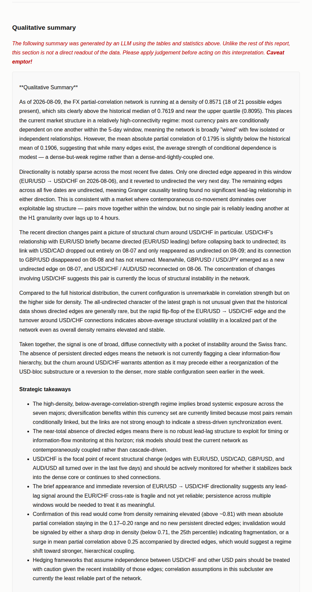
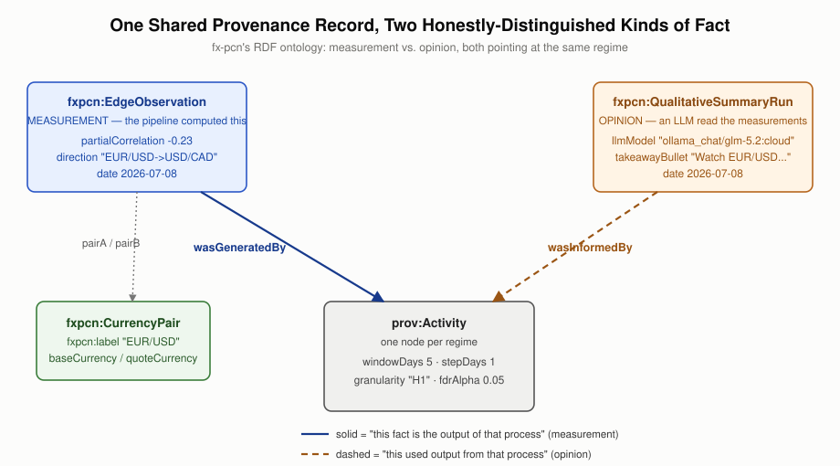
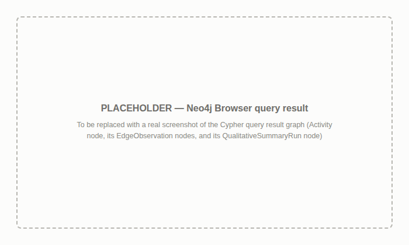

# Our Heroine Builds a Knowledge Graph — and Gives It a Memory

### How a Time-Varying Currency Conspiracy Became RDF the Rest of the Empire Can Read, Learned the Building's Shared Vocabulary, and Started Keeping a Dated Transcript of Its Own Opinions

Every day, our heroine's seven currency-pair henchmen — EUR/USD, GBP/USD, USD/JPY, USD/CHF, USD/CAD, AUD/USD, NZD/USD — get their alliances re-litigated: partial correlations recomputed net of the other five, Granger-causal chains of command reassigned, the whole conspiracy refit on a rolling window of hourly returns. That part of the story — what a partial-correlation network actually is, why plain pairwise correlation can't tell a real alliance from one that's only mediated through a shared boss, and how Granger causality settles who's giving the orders — is told properly in the original post, [Our Heroine Wiretaps Seven Currency Pairs](https://badassdatascience.substack.com/p/our-heroine-wiretaps-seven-currency), and it's worth reading first if any of that is new; this post takes the daily wiretap as a given and picks up exactly where that one left off.

Because producing the wiretap turned out to be the easy part. The hard part — the part this post is actually about — was making the result *legible*: turning a private, in-house data file only one department could read into a knowledge graph the rest of the empire could reason over, and then, once that graph existed, giving it something no ordinary surveillance file has: a dated, honestly-labeled record of what the empire's own analysts thought it meant, day after day, instead of a verdict that evaporates the moment tomorrow's report overwrites it.

*One day's org chart, 2026-07-08 — the raw material this whole post is about making legible to the rest of the building.*

## What a Knowledge Graph Actually Is

Before getting into how any of this actually got built, it's worth being precise about the destination, since that's the lens this whole post is written through. A **knowledge graph** is a collection of facts about entities, where each fact is a **triple** — a subject connected to an object through a named relationship (`EUR/USD` → *partial correlation* → `-0.23`, roughly) — and, critically, every entity and every relationship has a real, globally unique name rather than a private, in-file convention only one system understands.

Stack enough of these typed facts together and what you get is a web, not a table: there's no fixed row-and-column shape, no schema migration required to add a new kind of fact tomorrow, and — the part that actually matters once more than one department is involved — no requirement that two different projects' facts live in the same file, or even the same format, before they can be reasoned over together. Two knowledge graphs only need to agree, at the handful of points where their subject matter actually overlaps, on what a given name *means*. Everything that follows in this post is really one long answer to a single question: what does it actually take to make a time-varying currency conspiracy live up to that standard?

## Where the Parquet File Comes From — and Why It's Still a Private Dialect

Every day, this pipeline's actual output lands in a **parquet file**: one row per `(date, pair_i, pair_j)` edge, written by the same `run-pipeline` command the original wiretaps post walked through. Parquet isn't an arbitrary choice, either — it's a columnar binary format built for exactly this shape of tabular data: fast to write incrementally as new dates arrive, and fast to filter down to a single date's rows later without reading the whole file, which is why most numeric pipelines like this one reach for it over a plain CSV. For a pipeline talking to itself, that's a genuinely good format.

The trouble starts the moment a second reader shows up. A parquet file, or a CSV, or a SQL table, is a closed dialect: its meaning lives outside the file, in a schema some human wrote down once, in column names that are only self-explanatory to whoever already knows the project. Reading `edges.parquet` requires already knowing that `pair_i` and `pair_j` mean what they mean, that `direction` is a string that sometimes contains an arrow, that a missing row means "no edge" and not "no data." That's a fine arrangement when exactly one department ever reads the file. It becomes a real liability the moment two departments want to ask a question that spans both of their filing cabinets — "did the currency conspiracy shift on the same days the news division was covering a central bank meeting" is not a question either department's schema was built to answer, and it never will be, because their schemas don't know the other one exists.

Every department in the empire — the strategic-intelligence division that reads the news, the resume-hacking division that catalogs skills and experience — keeps its own ledger in its own dialect too, and none of them can currently be read by anyone outside their own filing cabinet.

RDF (Resource Description Framework) is the specific standard this project uses to actually build the kind of knowledge graph just described, and it fixes the dialect problem by making meaning part of the data instead of a side document someone has to already know. Every fact becomes a triple — subject, predicate, object — and every subject and predicate is a URI, a globally unique name, not a column position meaningful only within one table. `EUR/USD has partial correlation -0.23 with USD/CAD` isn't a row three columns deep in a file only one pipeline knows how to parse anymore; it's a fact anyone can retrieve, decorate further, or link to a fact from an entirely different file, because the things it's about — `EUR/USD`, `USD/CAD`, "partial correlation" itself — have real, dereferenceable names rather than private, in-file conventions.

## What an Ontology Is, Before Minting One

One more term worth pinning down before going further, since this post is about to lean on it. In knowledge-graph terms — and, increasingly, in AI/LLM terms too, since retrieval and agent systems now lean on the same idea to keep a model grounded in what a fact actually means, rather than guessing — an **ontology** is a formal, explicit specification of the *kinds* of things that exist in a domain and how they're allowed to relate to each other. It's one level more abstract than any single fact: not "EUR/USD has partial correlation -0.23 with USD/CAD" itself, but the prior agreement that "CurrencyPair" and "partial correlation" are meaningful categories at all, and what kind of thing each property is allowed to connect.

It plays roughly the same role a schema plays for a database — except an ontology is itself written in the same triple language as the facts it governs, which means it's inspectable and extendable right there in the graph, not fixed off in a separate migration file only a database administrator can touch.

## A Small Ontology of Its Own, Borrowed Provenance Where It Already Existed

Nothing standard describes "time-varying partial-correlation network with Granger-causal edge direction" — this is not a well-known enough kind of fact for RDFS, Schema.org, or any other off-the-shelf vocabulary to have already named it. So the export mints a small custom ontology, the `fxpcn:` namespace: `CurrencyPair` for one of the henchmen, `EdgeObservation` for one `(date, pair_i, pair_j)` row, `NetworkSnapshot` for a day's density summary, `DirectionFlip` for a changed relationship, and a small handful of properties on each. Sometimes the honest move is inventing exactly the vocabulary the data needs, rather than forcing it into a standard that almost, but doesn't quite, fit.

What isn't invented is provenance. "Which pipeline run, with which parameters, produced this fact" is an extremely well-trodden problem, and PROV-O already solves it properly — so every `EdgeObservation` points at a `prov:Activity` node via `prov:wasGeneratedBy`, one `Activity` per distinct regime (window length, step size, minimum observations, max lag, FDR alpha, granularity) rather than one per row, so a full-history run's tens of thousands of edges share a single provenance node instead of repeating the same handful of numbers over and over.

Reusing PROV-O here instead of rolling a bespoke `fxpcn:producedBy` property means any tool that already understands provenance — and a great many do — understands this data's provenance too, for free. It's a small decision that pays for itself the moment a second knowledge graph enters the picture, which, as it turns out, is exactly what happens next.

## Teaching the Currency Henchmen a Shared Vocabulary

Here's where it gets genuinely interesting, and where a naive approach would have failed outright. The obvious next step, once a knowledge graph of currency pairs exists, is wanting to connect it to the *other* knowledge graph the empire already maintains — a nightly intelligence pipeline that reads the news and tags it with concepts like "European Central Bank" or "interest rate." The tempting move is to try to link `EUR/USD` directly to whatever that pipeline calls the Eurozone. It doesn't work, and it's worth explaining why, because the failure mode is instructive: linking two knowledge graphs together generally means deciding whether two differently-labeled things are *the same concept* — a matching problem, usually solved with string-similarity search and a human or an LLM adjudicating the ambiguous cases.

But "EUR/USD" and "European Central Bank" were never the same concept to begin with. No amount of clever string matching finds a link that isn't an identity claim in the first place; asking a same-concept-detector to find a completely different kind of relationship is asking it to fail.

The fix was to stop trying to match a ticker symbol against a news vocabulary at all, and instead insert the fact that actually mediates the two: every currency has exactly one issuing region and, often, one central bank, and that's not a matching problem, it's just static, hand-authored knowledge with zero ambiguity — EUR issues from the European Union and the European Central Bank, USD from the United States and the Federal Reserve, and so on for all eight currencies across the seven pairs. Only *those* new nodes — "European Union," "Federal Reserve," genuinely fuzzy, genuinely nameable real-world entities — get typed as `skos:Concept` with a `skos:prefLabel`, deliberately matching the exact vocabulary convention the empire's concept-linking infrastructure already expects, rather than another custom `fxpcn:` type. That's the part that turns "impossible matching problem" into "already-solved matching problem": once the mediating entity exists and speaks SKOS, the existing linking machinery can do what it was built for.

This wasn't left to guesswork, either. Before deciding which of "issuing region," "issuing institution," or "currency name" was worth minting, the actual target vocabulary — a real, 7,635-concept knowledge graph built from RSS news feeds — got checked by hand. Region names turned out to be a clean sweep: all eight currencies' countries or blocs exist as exact-string concepts.

Institution names were a genuine mixed bag: the Federal Reserve, the European Central Bank, the Bank of England, and the Bank of Japan are all there; the Bank of Canada, the Swiss National Bank, and the Australian and New Zealand reserve banks are not. Worse than simply missing, the Royal Bank of Canada — a commercial bank, not a central bank, and not the same institution at all — *is* present, which would have been a textbook false-friend trap for a label-similarity linker if "Bank of Canada" had been minted anyway and gotten matched to the wrong entity.

So four currencies get an institution link and four don't, and none of them get a currency-name link at all, because checking first found that field of the vocabulary essentially empty. Guessing at which framing would work and shipping it anyway would have produced a knowledge graph confidently wrong in a way nobody would have noticed until it mismatched something in production.

As of this writing, that layer has, in fact, been registered against the empire's concept-linking hub and linked in production — all eight regions and all four institutions genuinely connected into its canonical concept scheme — though loading any of this into an actual queryable triple store remains a deliberate, separate, manually-triggered step, not something the pipeline does on its own.

## The Graph Had the Facts, But No Opinions

For a while, that was the whole graph, and it was a graph of measurements only — every triple in it was something the pipeline had computed and could stand behind. But `generate-report`, the command that renders the project's self-contained HTML report of graphs and tables, closes with a section it doesn't compute so much as *ask for*: an LLM call, made once the day's numbers are already in hand. That call isn't handed raw prices or left to guess; it's given exactly what the pipeline itself has already derived — that day's regime and network parameters, the full-history statistics for density and average relationship strength, the last several days' density readings, and the most recent direction flips — and asked to write a few plain-language paragraphs on what the current numbers suggest, closing with a short, clearly-headed list of concrete strategic takeaways: which relationships are worth watching, and what would confirm or undercut the current read going forward.

The model itself is swappable — a local Ollama model by default, or anything else `litellm` can reach, Anthropic's Claude included, picked with a flag or an environment variable — because the debriefing shouldn't care which informant is on shift. And like any informant, it's occasionally unreachable: the step is optional (skip it outright with `--no-llm-summary`), and if the call fails or comes back empty, the report simply runs without one that day rather than refusing to render at all.

*The actual "Qualitative summary" section of a real report — narrative first, "Strategic takeaways" bullets at the end, and a warning that this section, unlike everything above it, is an LLM's read rather than a direct readout of the data. Everything below is about what happens to those bullets next.*

That debrief was genuinely useful, and it was also, structurally, a conversation the knowledge graph knew nothing about. The moment tomorrow's report rendered, today's read was gone — not archived, not queryable, just quietly overwritten by whatever the model said next, the way a debriefing room with no stenographer produces a very confident verbal briefing and absolutely nothing you could go back and check three weeks later. Meanwhile, the actual wiretap data — the edges, the density snapshots, the direction flips — already spoke fluent RDF, joinable across the empire's whole knowledge graph. The hard evidence had a permanent file. The analyst's own interpretation of that evidence did not, which is a strange thing to leave undocumented in a graph this otherwise paranoid about provenance.

## A Debrief Deserves a Transcript, Not Just a Verdict

The fix isn't to dump the entire LLM narrative into the graph — free-flowing prose isn't a fact, it's a speech, and stuffing a paragraph into a single RDF literal doesn't make it queryable, just long. What's actually worth filing are the discrete, specific claims at the end of the summary: the strategic takeaways, the handful of concrete things worth watching. So the prompt closes with an explicit instruction to write those takeaways under a fixed heading, `STRATEGIC TAKEAWAYS:`, one bullet per line. Parsing that back out is deliberately unglamorous — no JSON schema, no function-calling, no second LLM call asking a model to reformat its own answer. A local model talking to itself through Ollama is far more reliable at echoing back a literal string it was told to use than at emitting well-formed JSON on the first try, so the parser just looks for the heading and reads bullet lines after it. Boring and robust beats clever and occasionally malformed, especially when nobody's proofreading the output before it becomes a triple.

And it's the exact same conversation both times — the bullets exported to RDF are parsed out of the identical LLM call that produces the report's narrative, not a second, independently-prompted one, so there's no version of events where the filed testimony and the report on the boardroom table quietly disagree with each other.

## Filed Separately, and Typed as Testimony, Not Surveillance

The natural instinct is to fold these new facts straight into the same RDF file the numeric network already exports to — one filing cabinet, one export command, done. That instinct is wrong on two separate counts, and both of them are knowledge-graph concerns, not just software-engineering ones. The operational count first: the wiretap logs — the edges, the density snapshots, the direction flips — are produced by a deterministic pipeline with no external dependency once the price data's in hand; they can be exported at any hour, reliably, forever. The debrief depends on an LLM being reachable and cooperative that day, which is a meaningfully less reliable proposition. If the two were exported together, a bad afternoon for the local Ollama server would mean the *entire* RDF export fails — the hard evidence held hostage by whether the analyst felt like talking. So the debrief gets its own export, run as a step independent of the numeric one; an unreachable LLM now means one missing debrief for one day, filed as such, while the wiretap logs keep flowing exactly as they always did.

It's also why both exports are careful about the URIs they mint in the first place, not just the file boundary between them: the empire's actual practice is to load a whole run of these `.ttl` files — one per parameter regime, numeric and debrief alike — into a single shared Neo4j graph via the `n10s` (neosemantics) plugin, which enforces that every URI be unique. Fold the regime into every `EdgeObservation`/`NetworkSnapshot`/`DirectionFlip`/`QualitativeSummaryRun` URI, as this project's export already does, and two differently-configured runs observing the same pair on the same date simply mint two different, coexisting nodes instead of one silently overwriting the other the moment they land in the same store.

The second count is about honesty in the graph itself. A partial correlation is a measurement; a strategic takeaway is somebody's read of a measurement, one step removed, and mixing the two in a graph without saying so is how "the network is 40% denser this week" quietly turns into "the network is dangerously fragile this week" three queries later, with nobody able to tell where the hard number ended and the opinion began. So each day's takeaways get filed on their own node type, `fxpcn:QualitativeSummaryRun`, holding one `fxpcn:takeawayBullet` literal per bullet and an `fxpcn:llmModel` property naming exactly which model gave this particular read — worth recording on its own, since a different model reading the same numbers might reasonably reach a different verdict, and a good file always says who's talking. That node links back to the same `prov:Activity` node the numeric export already mints for that day's regime — the same provenance record, reused rather than duplicated — but through `prov:wasInformedBy`, not `prov:wasGeneratedBy`. The distinction is small in syntax and large in meaning: `wasGeneratedBy` says *this fact is the output of that process*, the correct claim for a partial correlation the pipeline actually computed; `wasInformedBy` says *this activity used output from that other one*, the correct claim for an opinion formed by reading the pipeline's output after the fact.

Get that backwards and a knowledge-graph consumer has no honest way to ask "just give me the measured facts" without also getting the analyst's hunches mixed in. This is, in the end, the same discipline the region-and-institution vocabulary layer practiced earlier for a different reason: a knowledge graph is only as trustworthy as its willingness to say plainly where the confident claims end.

*The measurement and the opinion about it, sharing one provenance record but never pretending to be the same kind of fact.*

## A Knowledge Graph Remembers Every Day, Not Just Today

Here's the part worth walking through carefully, because the first draft of this design got it wrong in a way that's easy to miss and expensive to leave uncaught. The natural pattern to copy was the HTML report's own behavior: recompute fresh, overwrite, done — today's read replaces yesterday's, the same way today's report page replaces yesterday's page. That's exactly right for a report meant to be read once and discarded, and exactly wrong for a knowledge graph, whose entire point is answering questions a single day's snapshot never could — "how has the empire's own read on itself shifted over the last few weeks" is precisely the kind of longitudinal, connect-the-dots question a graph is good for, and a design that silently discards yesterday's testimony the moment today's lands can never answer it, no matter how well-formed the RDF is on any given day.

The fix was to stop treating the debrief as a one-off snapshot and start treating it exactly like every other dated fact this pipeline already tracks. The density and direction-flip tables were never rebuilt from scratch on each run — they're appended, one new date's rows added to the ones already on file, so the whole history stays on the record as the pipeline keeps running.

The takeaway bullets now follow that same convention: each report date's bullets get written to an accumulating table, one row per bullet per date, using the identical incremental-merge logic already responsible for appending density and direction-flip history rather than a new mechanism invented just for this. The export then walks every distinct date present in that accumulated table and mints a separate `fxpcn:QualitativeSummaryRun` for each one — not just today's — so the resulting graph holds the network's stated interpretation on every day it was ever asked to give one, each carrying the same `fxpcn:date` literal every other dated node in the graph already carries. That shared literal is what makes the whole thing worth doing: it's now possible to ask a graph consumer for both the network's numeric state *and* its own stated read of itself, for the same specific date, which wasn't a question either export could answer on its own before this.

It's also worth being honest about the edge case that motivated checking this so carefully: what happens on a day the debriefing room is simply empty, because the LLM call failed and there's nothing to file? The accumulation logic has to be careful there too — an empty day's file, read back as the "existing" record to append onto, can't be allowed to look like an empty history and silently swallow every future day's bullets along with it. Getting the append logic right for that specific quiet failure mode was most of the actual engineering effort here, which is a very on-brand lesson for a knowledge graph this paranoid about provenance: it's not the loud failures that burn you, it's the empty room nobody double-checked.

## Where the Graph Stands Today

To be precise about scope, because it's easy for "knowledge graph" to sound grander than what actually exists: both exports — the numeric wiretap logs and the dated debrief transcripts — produce `.ttl` files, full stop, and that's genuinely the deliverable this whole post has been about. Everything discussed above — the custom `fxpcn:` ontology, the reused PROV-O provenance, the SKOS-typed region and institution links, the honest `wasGeneratedBy`-versus-`wasInformedBy` split between measurement and opinion, the URIs that fold in enough identifying detail to stay collision-free — is a property of those two files themselves, sitting on disk, independently valid RDF whether or not anything downstream ever touches them. Any consumer that already speaks RDF can load either `.ttl` file on its own today and start asking questions of it, no additional infrastructure required.

What *is* deliberately left to a separate, manually-triggered step, outside this codebase entirely, is everything that happens after: loading a run of these files into a shared **Neo4j** graph via the `n10s` plugin — the same store the empire's other knowledge-graph-producing projects load their own exports into — and, once fx-pcn's region/institution layer has been registered and linked against the empire's concept-linking hub, asking cross-project questions of the *merged* result through the hub's own natural-language query tool, `graph-nexus-ask`.

That's the point at which "the currency conspiracy shifted on the same days the news division was covering a central bank meeting" stops being a rhetorical example from earlier in this post and becomes an actual question someone can type. But nothing about that later step changes what this project itself produces or is responsible for: two well-typed `.ttl` files, built so that handoff to Neo4j and `graph-nexus-ask` costs nothing extra when someone chooses to take it, and costs nothing at all if they never do — a design, throughout, that keeps hard measurement and stated opinion honestly distinguishable inside them, where a `CurrencyPair` never gets confused with a `Currency`'s issuing region, and an `EdgeObservation` a machine computed never gets confused with a `QualitativeSummaryRun` an LLM wrote.

*The ontology diagram above wasn't hypothetical — this is that same shape, pulled straight out of a real Neo4j graph after loading both `.ttl` files via `n10s`: one `prov:Activity` node for a single day's regime, that day's `EdgeObservation` nodes hanging off it through solid `wasGeneratedBy` edges, and that same day's `QualitativeSummaryRun` hanging off the identical node through a `wasInformedBy` edge instead. Measurement and opinion, visibly sharing one provenance record rather than just being described as doing so.*

## Conclusion

A knowledge graph is what happens when a department stops writing its ledger in a private dialect and starts writing it in a language the rest of the building can already parse — not by merging every department's records into one incoherent pile, but by making each fact self-describing enough that connecting two of them, when it's actually warranted, costs one new triple instead of a rewritten schema. Our heroine's seven currency henchmen can now file their daily conspiracy reports in a format the rest of the empire could, in principle, cross-reference against the news, decorated with exactly the mediating vocabulary that makes such a connection possible without ever forcing a false match. And because the graph now keeps a dated, provenance-tagged transcript of its own daily interpretation of itself — filed separately, typed distinctly, and never overwritten — our heroine can finally go back and check whether last month's read on the conspiracy held up, instead of just trusting whoever was talking that day. That's the whole point of keeping records instead of vibes: not just knowing what happened, but being able to ask, honestly, what the empire thought it meant at the time.

# Code

Code implementing this project is available [here](https://github.com/badass-data-science/forex-partial-correlation-network).

# AI Use Statement

This post was initially drafted by Claude at the author's direction, synthesizing and restructuring this project's earlier "Our Heroine Teaches Her Currency Henchmen to Speak the Empire's Language" and "Our Heroine Debriefs the Currency Conspiracy, and Keeps Every Transcript" posts around a single, unified knowledge-graph narrative, and then revised by a human before publication.

## Tags

- Data Science
- Python
- RDF
- Knowledge Graphs
- Semantic Web
- SKOS
- PROV-O
- LLM Applications
- Forex
- Quantitative Finance
- Time Series
